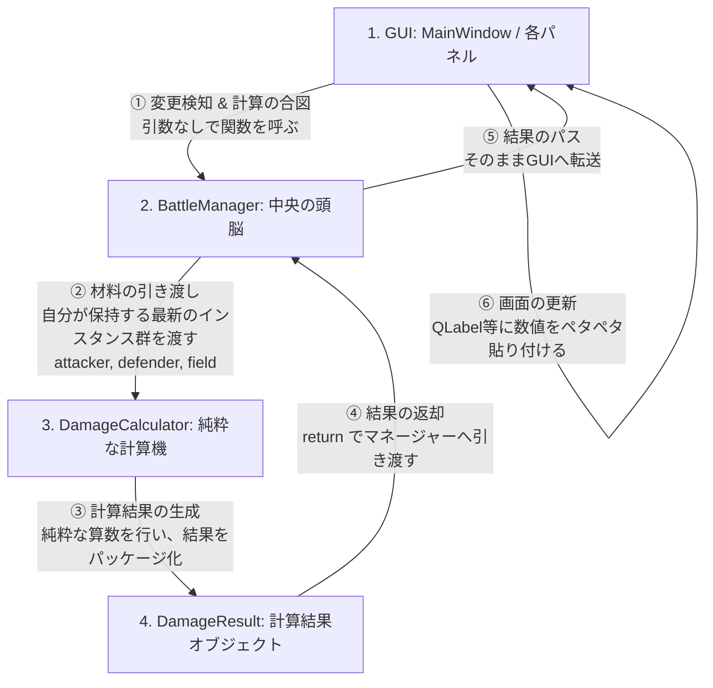

# ポケモンダメージ計算アプリ 設計フローチャート

本ドキュメントは、GUI、バトルマネージャー（データ管理）、およびカリキュレーター（計算機）の間の連携フローと役割分担をまとめた設計書です。

## 1. 全体連携フローチャート

以下は、画面（GUI）での変更を検知してから、最新の計算結果が画面に反映されるまでのデータのキャッチボールの流れです。



---

## 2. 各オブジェクトの役割分担と実装イメージ（カプセル化と分離）

それぞれのオブジェクトが「何を知っていて」「何をするのか」を明確に分けることで、バグの起きない美しいコードになります。

### 🎨 ① GUI (MainWindow / 各パネル)
- **役割**: 見た目の管理と、ユーザー操作（変更）の検知。
- **仕事内容**: 
  - コンボボックスやスライダーが動いたことを検知（シグナル）する。
  - 変更があったら、マネージャーの計算トリガー関数を呼ぶ（引き金を引くだけ）。
  - 返ってきた `DamageResult` の数字を画面（`QLabel` 等）に映し出す。

```python
# 【実装イメージ】
class MainWindow(QMainWindow):
    def __init__(self):
        super().__init__()
        self.battle_manager = BattleManager()
        # ... パネルの生成など ...
        
        # 変更を検知したら、再計算関数を動かすように紐付ける
        self.attacker_panel.combo_box.currentIndexChanged.connect(self.update_damage)

    def update_damage(self):
        # 1. マネージャーに合図を出して、結果を直接受け取る
        result = self.battle_manager.trigger_recalculation()
        # 2. 結果を画面に貼り付ける
        self.result_label.setText(f"ダメージ: {result.final_damage_range[0]} 〜")
```

### 🏢 ② BattleManager (中央の頭脳)
- **役割**: 現在の「状態（データ）」の管理と、計算の仲介。
- **仕事内容**:
  - 現在場に出ている「アタッカー」「ディフェンダー」「フィールド」のインスタンスを常にキープしておく。
  - GUIから合図されたら、自分が持っている上記のインスタンス群を、部下の `DamageCalculator` に横流しして計算させる。

```python
# 【実装イメージ】
class BattleManager(QObject):
    def __init__(self):
        super().__init__()
        # 常に最新のインスタンスをキープする変数たち
        self.attacker: PokemonInstance = None
        self.defender: PokemonInstance = None
        self.field: FieldState = None

        # 部下（カリキュレーター）
        self.calculator = DamageCalculator()

    def trigger_recalculation(self) -> "DamageResult":
        # 自分の持っている材料を部下に渡して、計算結果をGUIへ返す
        return self.calculator.calculate(self.attacker, self.defender, self.field)
```

### 🧮 ③ DamageCalculator (純粋な計算機)
- **役割**: 与えられた材料（データ）を使って、泥臭い算数（ダメージ計算）をするだけの職人。
- **仕事内容**:
  - マネージャーからバラバラの材料を貰う。
  - 画面の存在は一切知らず、「貰ったデータだけ」を使ってタイプ相性や特性補正の掛け算を行う。
  - 計算が終わったら、1つのパッケージ（`DamageResult`）にして突き返す。

```python
# 【実装イメージ】
class DamageCalculator:
    def calculate(self, attacker, defender, field) -> "DamageResult":
        # ここで補正値や乱数の泥臭い計算をガシガシ行う
        damage_list = [45, 46, 47, 48, 50]

        # 結果をオブジェクトに詰めて返す
        return DamageResult(final_damage_range=damage_list, kill_chance="確定3発")
```

### 📦 ④ DamageResult (計算結果オブジェクト)
- **役割**: 計算結果の数値やメッセージを綺麗にまとめただけの「使い捨ての箱」。
- **仕事内容**:
  - 乱数のダメージ幅や、確定数メッセージなどを保持する。計算処理などの複雑な機能は持たない。

```python
# 【実装イメージ】
from dataclasses import dataclass
from typing import List


@dataclass
class DamageResult:
    final_damage_range: List[int]  # 例: [45, 46, 47, ...]
    kill_chance: str  # 例: "確定3発"
    # 必要に応じて「急所時のダメージ」などの変数を増やしていく
```

---

## 3. この設計（フロー）が最強である理由

1. **GUIが超ラクになる**: GUIはいちいち「どのポケモンが選ばれているか」を調べて材料をかき集める必要がありません。ただマネージャーの関数を1行呼ぶだけで最新の結果が返ってきます。
2. **計算機が完全に独立する**: `DamageCalculator` は画面の存在を知りません。これにより、画面を表示させずに裏側だけで一瞬で計算テスト（自動テスト）を行うことが可能になります。
3. **バグが起きない**: マネージャー自身に計算結果を永続保存させず、その都度 `DamageResult` インスタンスを生成して「使い捨てる（返却する）」ため、古いデータと新しいデータがごちゃ混ぜになる事故が100%防げます。